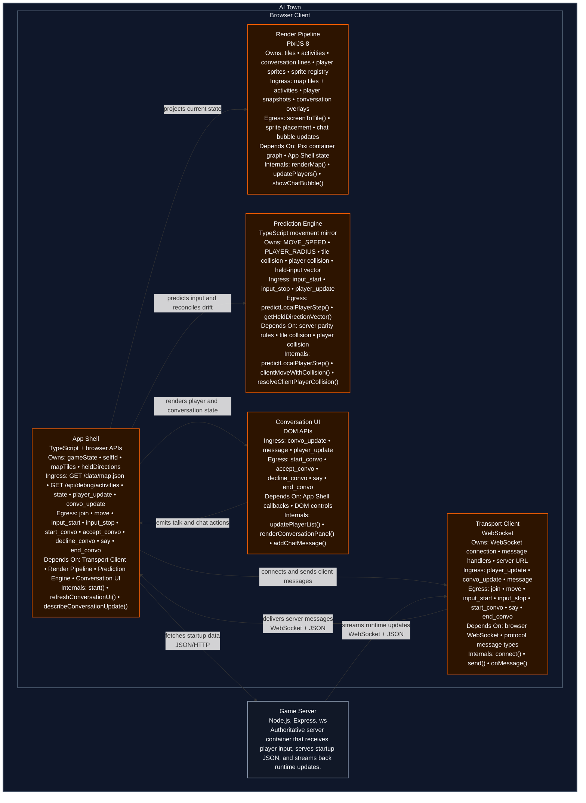

# Component Diagram

_Generated from `tools/extractor/graph.json`._

## Browser Client

```mermaid
flowchart TB
  classDef boundary fill:#0f172a,stroke:#475569,stroke-width:2px,color:#e5e7eb;
  classDef application fill:#111827,stroke:#94a3b8,stroke-width:1.5px,color:#f8fafc;
  classDef datastore fill:#07121f,stroke:#14b8a6,stroke-width:1.5px,color:#f8fafc;
  classDef client fill:#2d1400,stroke:#FE6100,stroke-width:1.5px,color:#f8fafc;
  classDef server fill:#111827,stroke:#648FFF,stroke-width:1.5px,color:#f8fafc;
  classDef network fill:#0a2230,stroke:#22D3EE,stroke-width:1.5px,color:#f8fafc;
  classDef engine fill:#0f1a3d,stroke:#648FFF,stroke-width:1.5px,color:#f8fafc;
  classDef npc fill:#2d0a1a,stroke:#DC267F,stroke-width:1.5px,color:#f8fafc;
  classDef persistence fill:#2d1d00,stroke:#FFB000,stroke-width:1.5px,color:#f8fafc;
  classDef debug fill:#1f2937,stroke:#d1d5db,stroke-width:1.5px,color:#f8fafc;

  subgraph component_view_browser_client_system["AI Town"]
    direction LR
    component_view_browser_client_container_game_server["Game Server<br/>Node.js, Express, ws<br/>Authoritative server container that receives player input, serves startup JSON, and streams back runtime updates."]
    subgraph component_view_browser_client_boundary["Browser Client"]
      direction TB
      component_view_browser_client_app_shell["App Shell<br/>TypeScript + browser APIs<br/>Owns: gameState • selfId • mapTiles • heldDirections<br/>Ingress: GET /data/map.json • GET /api/debug/activities • state • player_update • convo_update<br/>Egress: join • move • input_start • input_stop • start_convo • accept_convo • decline_convo • say • end_convo<br/>Depends On: Transport Client • Render Pipeline • Prediction Engine • Conversation UI<br/>Internals: start() • refreshConversationUi() • describeConversationUpdate()"]
      component_view_browser_client_transport_client["Transport Client<br/>WebSocket<br/>Owns: WebSocket connection • message handlers • server URL<br/>Ingress: player_update • convo_update • message<br/>Egress: join • move • input_start • input_stop • start_convo • say • end_convo<br/>Depends On: browser WebSocket • protocol message types<br/>Internals: connect() • send() • onMessage()"]
      component_view_browser_client_render_pipeline["Render Pipeline<br/>PixiJS 8<br/>Owns: tiles • activities • conversation lines • player sprites • sprite registry<br/>Ingress: map tiles + activities • player snapshots • conversation overlays<br/>Egress: screenToTile() • sprite placement • chat bubble updates<br/>Depends On: Pixi container graph • App Shell state<br/>Internals: renderMap() • updatePlayers() • showChatBubble()"]
      component_view_browser_client_prediction_engine["Prediction Engine<br/>TypeScript movement mirror<br/>Owns: MOVE_SPEED • PLAYER_RADIUS • tile collision • player collision • held-input vector<br/>Ingress: input_start • input_stop • player_update<br/>Egress: predictLocalPlayerStep() • getHeldDirectionVector()<br/>Depends On: server parity rules • tile collision • player collision<br/>Internals: predictLocalPlayerStep() • clientMoveWithCollision() • resolveClientPlayerCollision()"]
      component_view_browser_client_conversation_ui["Conversation UI<br/>DOM APIs<br/>Ingress: convo_update • message • player_update<br/>Egress: start_convo • accept_convo • decline_convo • say • end_convo<br/>Depends On: App Shell callbacks • DOM controls<br/>Internals: updatePlayerList() • renderConversationPanel() • addChatMessage()"]
    end
  end
  class component_view_browser_client_system boundary;
  class component_view_browser_client_boundary boundary;

  class component_view_browser_client_container_game_server application;
  class component_view_browser_client_app_shell client;
  class component_view_browser_client_transport_client client;
  class component_view_browser_client_render_pipeline client;
  class component_view_browser_client_prediction_engine client;
  class component_view_browser_client_conversation_ui client;

  component_view_browser_client_app_shell -->|"connects and sends client messages"| component_view_browser_client_transport_client
  component_view_browser_client_transport_client -->|"delivers server messages<br/>WebSocket + JSON"| component_view_browser_client_app_shell
  component_view_browser_client_app_shell -->|"projects current state"| component_view_browser_client_render_pipeline
  component_view_browser_client_app_shell -->|"predicts input and reconciles drift"| component_view_browser_client_prediction_engine
  component_view_browser_client_app_shell -->|"renders player and conversation state"| component_view_browser_client_conversation_ui
  component_view_browser_client_conversation_ui -->|"emits talk and chat actions"| component_view_browser_client_app_shell
  component_view_browser_client_app_shell -->|"fetches startup data<br/>JSON/HTTP"| component_view_browser_client_container_game_server
  component_view_browser_client_container_game_server -->|"streams runtime updates<br/>WebSocket + JSON"| component_view_browser_client_transport_client
```

## Game Server

```mermaid
flowchart TB
  classDef boundary fill:#0f172a,stroke:#475569,stroke-width:2px,color:#e5e7eb;
  classDef application fill:#111827,stroke:#94a3b8,stroke-width:1.5px,color:#f8fafc;
  classDef datastore fill:#07121f,stroke:#14b8a6,stroke-width:1.5px,color:#f8fafc;
  classDef client fill:#2d1400,stroke:#FE6100,stroke-width:1.5px,color:#f8fafc;
  classDef server fill:#111827,stroke:#648FFF,stroke-width:1.5px,color:#f8fafc;
  classDef network fill:#0a2230,stroke:#22D3EE,stroke-width:1.5px,color:#f8fafc;
  classDef engine fill:#0f1a3d,stroke:#648FFF,stroke-width:1.5px,color:#f8fafc;
  classDef npc fill:#2d0a1a,stroke:#DC267F,stroke-width:1.5px,color:#f8fafc;
  classDef persistence fill:#2d1d00,stroke:#FFB000,stroke-width:1.5px,color:#f8fafc;
  classDef debug fill:#1f2937,stroke:#d1d5db,stroke-width:1.5px,color:#f8fafc;

  subgraph component_view_game_server_system["AI Town"]
    direction LR
    component_view_game_server_container_browser_client["Browser Client<br/>TypeScript, PixiJS, Browser APIs<br/>Browser application that sends player input and consumes authoritative runtime updates."]
    component_view_game_server_container_postgres["PostgreSQL + pgvector<br/>SQL, pgvector<br/>Optional durable datastore for memories, conversations, player records, and generation metadata."]
    component_view_game_server_container_world_data["World Data Files<br/>JSON and TypeScript files<br/>Static map and NPC seed artifacts loaded during startup and map serving."]
    subgraph component_view_game_server_boundary["Game Server"]
      direction TB
      component_view_game_server_websocket_gateway["WebSocket Gateway<br/>ws 8<br/>Owns: clients map • player/socket mapping<br/>Ingress: join • move • start_convo • accept_convo • decline_convo • say • input_start • input_stop • end_convo<br/>Egress: player_joined • player_left • player_update • convo_update • message<br/>Depends On: Simulation Core • protocol unions<br/>Internals: onMessage() • broadcastGameEvent() • toPublicPlayer()"]
      component_view_game_server_debug_api["Debug API<br/>Express 4<br/>Owns: GET debug routes • POST debug routes<br/>Ingress: GET /state • GET /map • GET /players • GET /activities • GET /log • GET /scenarios • GET /conversations • POST /tick • POST /spawn • POST /move • POST /input • POST /reset • POST /scenario • POST /start-convo • POST /say • POST /end-convo<br/>Egress: JSON snapshots • queued engine mutations • direct conversation mutations<br/>Depends On: Simulation Core • ASCII map renderer • scenario presets<br/>Internals: createDebugRouter() • renderAsciiMap() • persistPlayer()"]
      component_view_game_server_simulation_core["Simulation Core<br/>Pure TypeScript<br/>Owns: players_ • heldKeys_ • commandQueue_ • eventHandlers • afterTickCallbacks • logger_ • convoManager_<br/>Ingress: spawn • move_to • start_convo • accept_convo • decline_convo • say • end_convo • remove • setPlayerInput()<br/>Egress: spawn • despawn • player_update • convo_started • convo_active • convo_ended • convo_message<br/>Depends On: pathfinding • collision • SeededRNG<br/>Internals: GameLoop • World • ConversationManager • GameLogger<br/>World (world.ts): tiles[][] • activities<br/>ConversationManager (conversation.ts): conversations • playerToConvo • nextId<br/>GameLogger (logger.ts): ring buffer • event filters • debug reads"]
      component_view_game_server_npc_orchestration["NPC Orchestration<br/>Provider stack + memory retrieval<br/>Owns: runtime sessions • initiation cooldowns • reflection checkpoints • reflection in-flight set • recent human joins<br/>Ingress: spawn • despawn • convo_started • convo_active • convo_ended • convo_message • tick_complete<br/>Egress: start_convo • say • memory writes + generation records<br/>Depends On: MemoryManager • Resilient provider stack • Persistence Adapters<br/>Internals: NpcOrchestrator • MemoryManager • ResilientNpcProvider<br/>NpcOrchestrator (orchestrator.ts): reply scheduling • initiation scans • reflection triggering • persistence coordination<br/>MemoryManager (memory.ts): composite scoring • reflection logic • conversation summarization<br/>Provider Stack (provider.ts + resilientProvider.ts): NpcModelProvider • ResilientNpcProvider • ClaudeCodeProvider • ScriptedNpcProvider"]
      component_view_game_server_persistence_adapters["Persistence Adapters<br/>pg + pgvector / in-memory fallback<br/>Owns: MemoryStore • NpcPersistenceStore • schema + vector index<br/>Ingress: memory writes • conversation + message snapshots • generation records<br/>Egress: memory search results • restored runtime records<br/>Depends On: PostgreSQL + pgvector • in-memory fallback<br/>Internals: Repository • PostgresNpcStore • schema.sql<br/>MemoryStore (repository.ts): Repository • InMemoryRepository • logEvent()<br/>NpcPersistenceStore (npcStore.ts): PostgresNpcStore • InMemoryNpcStore • addGeneration()<br/>schema.sql (PostgreSQL + pgvector): 8 tables • vector(1536) • IVFFlat memory index"]
    end
  end
  class component_view_game_server_system boundary;
  class component_view_game_server_boundary boundary;

  class component_view_game_server_container_browser_client application;
  class component_view_game_server_container_postgres datastore;
  class component_view_game_server_container_world_data datastore;
  class component_view_game_server_websocket_gateway network;
  class component_view_game_server_debug_api debug;
  class component_view_game_server_simulation_core engine;
  class component_view_game_server_npc_orchestration npc;
  class component_view_game_server_persistence_adapters persistence;

  component_view_game_server_container_browser_client -->|"sends player commands<br/>WebSocket + JSON"| component_view_game_server_websocket_gateway
  component_view_game_server_websocket_gateway -->|"broadcasts runtime updates<br/>WebSocket + JSON"| component_view_game_server_container_browser_client
  component_view_game_server_container_browser_client -->|"fetches startup and debug snapshots<br/>JSON/HTTP"| component_view_game_server_debug_api
  component_view_game_server_websocket_gateway -->|"enqueues commands and input"| component_view_game_server_simulation_core
  component_view_game_server_debug_api -->|"reads state and mutates debug paths<br/>JSON/HTTP handlers"| component_view_game_server_simulation_core
  component_view_game_server_simulation_core -->|"emits events for fanout"| component_view_game_server_websocket_gateway
  component_view_game_server_simulation_core -->|"publishes conversation and tick events"| component_view_game_server_npc_orchestration
  component_view_game_server_npc_orchestration -->|"queues NPC dialogue actions"| component_view_game_server_simulation_core
  component_view_game_server_npc_orchestration -->|"retrieves memories and stores generations"| component_view_game_server_persistence_adapters
  component_view_game_server_persistence_adapters -->|"reads and writes runtime records<br/>SQL + pgvector"| component_view_game_server_container_postgres
  component_view_game_server_container_world_data -->|"loads map and seed data at startup<br/>file I/O"| component_view_game_server_simulation_core
```
